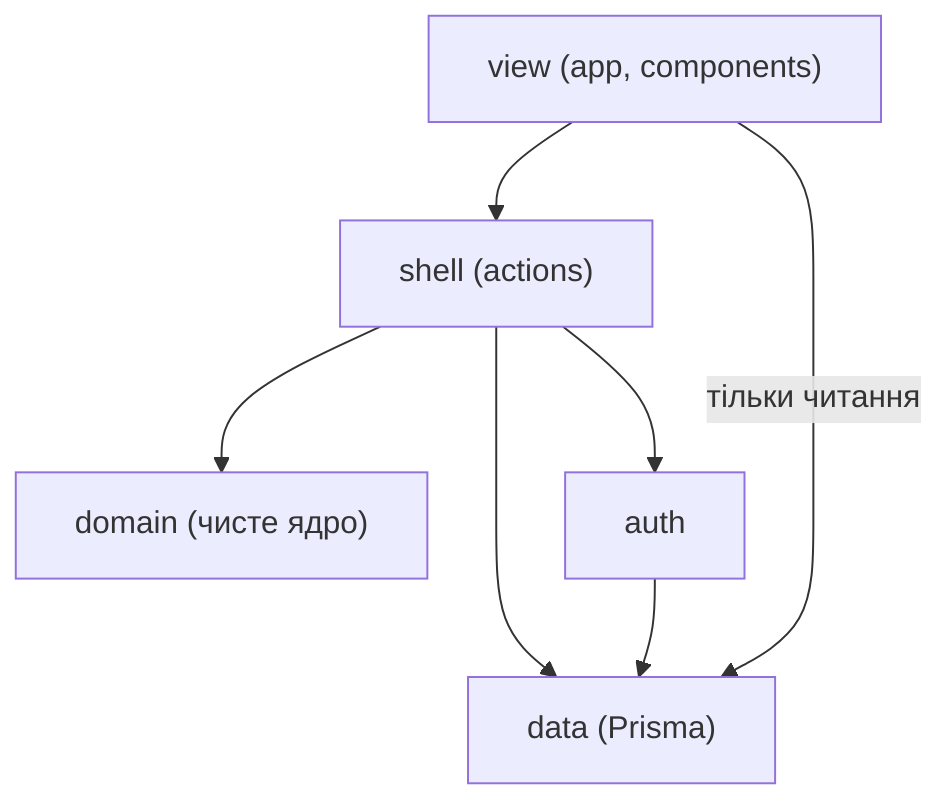
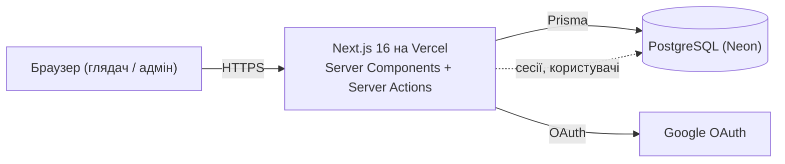
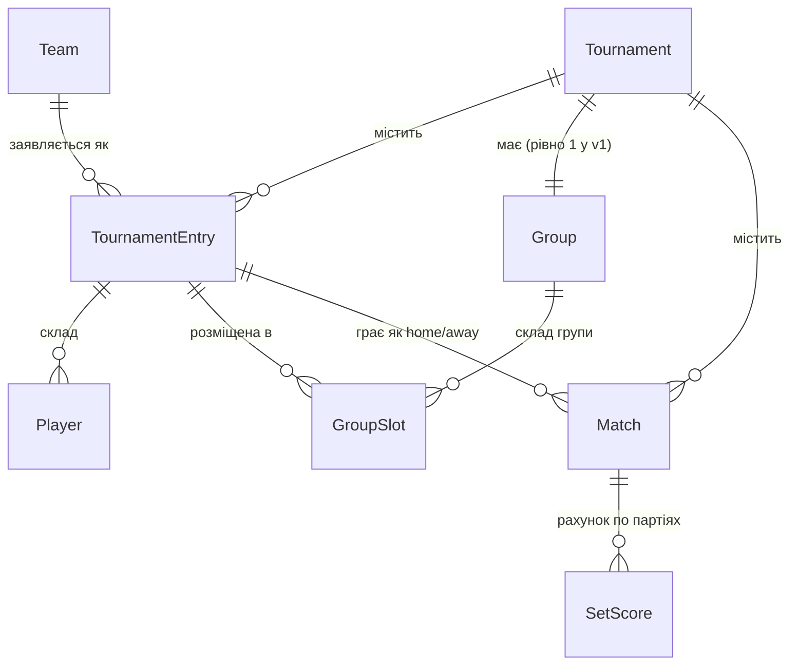

# Architecture Spine — cherkasy-volley

Контракт інваріантів для збірки платформи турнірів. Стислий: рішення — у блоках `AD-n`,
форма — у діаграмах. Обґрунтування живе в `.memlog.md`.

## Design Paradigm

**Функціональне ядро / імперативна оболонка** поверх повностекового Next.js (App Router).

| Шар | Каталог | Що містить | Залежить від |
| --- | --- | --- | --- |
| View | `src/app/**`, `src/components/**`, `src/lib/**` | Server/Client Components, тільки відображення; `src/lib` — view-утиліти (`cn`, `auth-client`) | shell, data (лише читання), `src/lib/auth-client` для сесії |
| Shell (імперативна оболонка) | `src/actions/**` | Server Actions: авторизація → читання → виклик ядра → запис | domain, data |
| Domain (функціональне ядро) | `src/domain/**` | Чисті функції: підрахунок, посів, сітка, валідація | нічого внутрішнього |
| Data | `src/data/**` | Prisma-клієнт і запити; єдиний власник кожної сутності | Prisma + типи схеми |
| Auth | `src/auth/**` | Better Auth конфіг, `requireAdmin()` | data |

## Invariants & Rules

### AD-1 — Один повностековий застосунок Next.js `[ADOPTED]`

- **Binds:** усю систему — UI і серверну логіку
- **Prevents:** розходження окремих фронтенду й бекенду; два деплої; CORS-поверхня для соло-супроводу
- **Rule:** увесь код — в одному Next.js-проєкті. Публічні сторінки — Server Components; усі зміни — Server Actions. Окремого API-сервісу немає.
- **Виняток (Story 1.5):** один route handler `src/app/api/auth/[...all]/route.ts` — HTTP-ендпоінт Better Auth. Це транспорт, не окремий сервіс.
- **Виняток (Story 1.6):** `src/app/admin/layout.tsx` імпортує гейт-поверхню `@/auth/requireAdmin` (`requireAdminPage()`) для захисту маршрутів `/admin/**`. Це санкціонований край `view → auth` для route protection — на відміну від інстансу Better Auth (`@/auth/auth`), який лишається поза view.

### AD-2 — Доменна логіка лише в `src/domain/`, чиста

- **Binds:** підрахунок таблиці, нарахування очок, посів плейофа, автопросування сітки, валідація рахунку (FR-5, FR-15, FR-17, FR-19, FR-20)
- **Prevents:** дві реалізації правил у різних епіках; логіку, розповзлену по компонентах, handler'ах і SQL
- **Rule:** `src/domain/` не імпортує Next, Prisma, `src/data`, `src/actions`. Функції детерміновані, без IO: `(вхідні дані) → результат`. Жоден компонент чи Server Action не рахує очки/партії/місця самостійно — лише викликає `src/domain/`.

### AD-3 — Напрям залежностей

- **Binds:** усі модулі
- **Prevents:** цикли; доступ ядра до БД; логіку в шарі відображення
- **Rule:** `view → shell → {domain, data}`; `auth → data`. Заборонено: `domain → *` (внутрішнє), `data → {domain, actions, view}`, `view → data (запис)`.
- **Note (Story 1.6):** гейт-поверхня `src/auth/requireAdmin.ts` (`requireAdmin`, `requireAdminPage`, `getSessionUser`) — санкціонований край `view → auth` для захисту маршрутів; інстанс `src/auth/auth.ts` лишається поза view. Lint блокує `src/components/**` від `@/auth`, але не `src/app/**`.



### AD-4 — `Match` + `SetScore` — єдине джерело істини про результати `[ADOPTED]`

- **Binds:** таблиці груп, підсумкові місця, стан сітки (FR-17, FR-21, FR-23, NFR-3)
- **Prevents:** стан таблиці, що розійшовся з матчами; подвійний облік результату
- **Rule:** результат матчу зберігається лише як рядки `SetScore`, прив'язані до `Match`. Таблиця групи й фінальні місця **не зберігаються** — обчислюються при кожному читанні через `computeStandings(matches, rules)`. Кеш/матеріалізація заборонені у v1.

### AD-5 — Матчі плейофа персистяться; пари наступних раундів похідні до результату

- **Binds:** формування й просування сітки (FR-19, FR-20, FR-21)
- **Prevents:** «застряглу» сітку після виправлення результату півфіналу; втрату розкладу/залу матчів плейофа
- **Rule:** матчі плейофа (півфінали, фінал, за 3-тє місце) — рядки `Match` зі `stage ≠ GROUP`, мають розклад і результат. `homeEntry/awayEntry` матчу наступного раунду обчислюються з результатів попереднього раунду **доки в самому матчі немає `SetScore`**; після внесення результату пара заморожена й не переобчислюється. Це обчислення виконує лише `domain/bracket.ts` (`advanceBracket`) — і на запис (Server Action), і на відображення (перед рендером сітки); `src/data` і компоненти не виводять учасників самостійно.

### AD-6 — Єдиний шлях змін: Server Action під `requireAdmin()` `[ADOPTED]`

- **Binds:** кожну операцію запису (FR-2, FR-3, FR-6, FR-7, NFR-1)
- **Prevents:** незахищений ендпоінт запису; контроль доступу лише на клієнті
- **Rule:** будь-яка зміна БД — тільки через Server Action у `src/actions/`, перший рядок якої — `await requireAdmin()` (кидає до будь-якого доступу до `src/data`). Іншого шляху запису немає. Роль — булеве `User.isAdmin`; надання/зняття — теж Server Action під `requireAdmin()`.

### AD-7 — Публічне читання йде повз захист і не бачить чернеток

- **Binds:** усі публічні сторінки (FR-2, FR-18, FR-22, FR-25, і §4.10 PRD)
- **Prevents:** витік турнірів у стані Чернетка; випадкову вимогу входу для глядача
- **Rule:** Server Components читають напряму через `src/data/` без перевірки ролі. Кожен публічний запит турнірів фільтрує `state != DRAFT`. Запити «для адміна» (з чернетками) — окремі функції `src/data/`, викликаються лише з-під `requireAdmin()`.

### AD-8 — `Tournament.state` змінюється лише явними переходами `[ADOPTED]`

- **Binds:** життєвий цикл турніру (FR-7, FR-11, FR-19; §Стан турніру Глосарія PRD)
- **Prevents:** турнір у суперечливому стані (плейоф без завершених груп; архів без фіналу)
- **Rule:** переходи `DRAFT → GROUP_STAGE → PLAYOFF → COMPLETED` — окремі Server Actions, кожна перевіряє передумови (напр. `PLAYOFF` лише коли всі групові `Match` мають `SetScore`; `COMPLETED` лише коли зіграно фінал і матч за 3-тє). Пряме присвоєння `state` поза цими переходами заборонене.

### AD-9 — `discipline` — enum; v1 фільтрує `CLASSIC`

- **Binds:** усю доменну модель і навігацію (FR-24; §Дисципліна Глосарія PRD)
- **Prevents:** переплетення даних/логіки класичного й пляжного; переробку моделі під пляжний пізніше
- **Rule:** `discipline: CLASSIC | BEACH` на `Tournament`. Уся логіка й запити v1 фільтрують `CLASSIC`. Значення `BEACH` і нокаут-значення `Match.stage` присутні в типах, але не мають UI й Server Actions.

### AD-10 — Схема — лише через міграції; довідкові дані — лише через seed

- **Binds:** усі зміни БД, перший адмін (§Технічний напрям addendum PRD)
- **Prevents:** дрейф схеми між середовищами; недокументоване створення адміна руками
- **Rule:** структура БД змінюється тільки версійованими міграціями Prisma. Перший `User.isAdmin=true` і будь-які довідкові дані створюються seed-скриптом. Секрети (`DATABASE_URL`, Google OAuth) — лише через env, ніколи в git.

### AD-11 — `src/data/` — єдиний власник і письменник кожної сутності

- **Binds:** усі сутності моделі (FR-8..FR-16, NFR-3)
- **Prevents:** двох власників однієї сутності; прямі Prisma-виклики з `actions`/`app`, що дублюють і розходяться в правилах запиту (напр. різні визначення «активного турніру»)
- **Rule:** Prisma-клієнт імпортується лише в `src/data/`. Кожне читання й запис проходить через іменовану функцію `src/data/` (`getPublicTournaments`, `saveMatchResult`, …). `src/actions` і `src/app` ніколи не імпортують Prisma напряму.

## Consistency Conventions

| Концерн | Конвенція |
| --- | --- |
| Іменування | Prisma-моделі — `PascalCase` однина; поля — `camelCase`; сегменти маршрутів — `kebab-case`; Server Actions — дієслівні `createTournament`, `enterMatchResult`; доменні функції — `computeStandings`, `seedPlayoff`, `advanceBracket`, `validateMatchScore` |
| Ідентифікатори | `cuid` (Prisma `@default(cuid())`) для всіх сутностей |
| Дати й час | зберігання — UTC (`DateTime`); відображення — `Europe/Kyiv`; форматування лише у View-шарі |
| Помилки Server Action | кидається типізована помилка → мапиться в `{ ok: false, code, message }` для клієнта; успіх — `{ ok: true, data }` |
| Мова | увесь UI — українська; окремої i18n-бібліотеки немає (одна мова) |
| Мутація стану | лише через Server Actions; `revalidatePath`/`revalidateTag` після кожного запису; клієнт не тримає похідних кешів таблиці |
| Автентифікація | Better Auth, Google-провайдер; сесія й користувачі — у власному Postgres; `requireAdmin()` у `src/auth/` — єдина точка перевірки ролі |
| Тести | доменні функції `src/domain/` покриваються юніт-тестами (детерміновані, без моків) — обов'язково для підрахунку, посіву, валідації |

## Stack

| Name | Version |
| --- | --- |
| TypeScript | 5.x |
| Node.js | 24 LTS |
| Next.js (App Router) | 16.x |
| React | 19.2 |
| Prisma ORM | 7.x |
| PostgreSQL | 16+ (Neon) |
| Better Auth | current major |
| Хостинг застосунку | Vercel (free tier, v1) |
| Хостинг БД | Neon (free tier, PITR-бекап — NFR-7) |

## Structural Seed

### Контейнери



### Ключові сутності



### Дерево коду

```text
src/
  app/                # маршрути; публічні сторінки — Server Components
    (public)/         # турніри, таблиці, розклад, сітка, архів — фільтр state != DRAFT
    admin/            # під requireAdmin(); створення/ведення турнірів
  components/         # відображення, без бізнес-логіки
  actions/            # Server Actions — імперативна оболонка; кожна: requireAdmin() → data → domain → data
  domain/             # чисте ядро
    scoring.ts        # computeStandings, points-per-match за пресетом
    tiebreak.ts       # очки → особиста зустріч → виграні партії → назва
    bracket.ts        # seedPlayoff, advanceBracket
    validation.ts     # validateMatchScore за пресетом і target (25/15)
  data/               # Prisma-клієнт + запити; єдиний власник запису
  auth/               # Better Auth конфіг, requireAdmin()
prisma/
  schema.prisma
  migrations/
  seed.mts            # перший адмін, довідкові дані (ESM, запуск через tsx)
```

## Capability → Architecture Map

| Можливість PRD | Живе в | Керується |
| --- | --- | --- |
| Вхід через Google, ролі (FR-1..FR-3) | `src/auth`, `src/actions/admin` | AD-6, конвенція «Автентифікація» |
| Створення/ведення турніру, переходи станів (FR-4..FR-7) | `src/actions/tournament` | AD-8 |
| Пресети очок (FR-5) | `src/domain/scoring.ts` | AD-2, AD-4 |
| Команди, склади, гравці (FR-8..FR-10) | `src/actions/team`, `src/data` | AD-6, AD-11 |
| Жеребкування + генерація календаря (FR-11, FR-12) | `src/actions/draw`, `src/domain/bracket.ts` | AD-2, AD-8 |
| Розклад — дата/час/зал (FR-13, FR-14) | `src/actions/schedule` | AD-6 |
| Внесення/виправлення результату (FR-15, FR-16) | `src/actions/result`, `src/domain/validation.ts` | AD-4, AD-6 |
| Таблиця групи (FR-17, FR-18) | `src/domain/scoring.ts` + `tiebreak.ts` | AD-4 |
| Плейоф: формування, автопросування, результати (FR-19..FR-22) | `src/domain/bracket.ts`, `src/actions/playoff` | AD-5, AD-8 |
| Річний архів (FR-23) | `src/app/(public)/archive` | AD-4, AD-7 |
| Дисципліни в меню, публічні сторінки (FR-24, FR-25) | `src/app/(public)` | AD-7, AD-9 |

## Deferred

- **Пляжна дисципліна та формат Кубка (нокаут).** Enum і `Match.stage` лишають місце; повна доменна логіка й UI — коли дійде черга (PRD §8.2).
- **Багатогруповий формат і посів між групами.** v1 — рівно одна `Group`. Модель дозволяє N; правила виходу — з регламенту (PRD Відкрите питання №1).
- **Матеріалізація таблиці.** Обчислення при читанні достатнє для поточного масштабу; кеш додається лише за реальної потреби в швидкості.
- **Сповіщення (email/Telegram) про розклад і результати.** Поза v1 (PRD §8.2); окремий вихідний адаптер, коли додаватиметься.
- **Перенесення на Docker/VPS.** Код збирається в контейнер; міграція з Vercel+Neon можлива без зміни архітектури — рішення відкладене до появи причини.
- **Аудит змін (хто що змінив).** PRD не вимагає; якщо знадобиться — окрема append-only таблиця, не впливає на доменні інваріанти.
- **Політика редагування результатів у завершеному турнірі** (PRD Відкрите питання №3) — поведінкове рішення, не архітектурне; `advanceBracket`/`computeStandings` однаково детерміновані.
